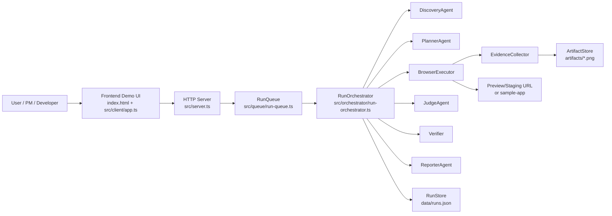
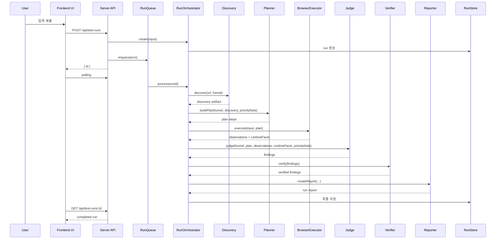

# QAI Architecture

작성일: 2026-03-23

## 1. 개요

QAI는 `preview/staging URL`의 핵심 퍼널을 실제 브라우저에서 실행하고, 수집된 evidence를 바탕으로 `배포 가능 / 보류` 판단을 내리는 `Agentic QA Release Gate`다.

현재 아키텍처는 범용 테스트 플랫폼이 아니라, 아래 조건에 맞춘 `제약된 agent workflow` 중심으로 설계되어 있다.

- 입력은 최소화한다: `URL`, `계정`, `환경`, `퍼널`, `priorityNote`
- 브라우저 액션은 deterministic하게 유지한다
- agentic 판단은 `계획`, `finding 분류`, `리포트 생성`에 집중한다
- high severity 또는 high confidence finding은 검증 단계를 거쳐 최종 verdict에 반영한다

## 2. 시스템 목표

현재 아키텍처의 목적은 다음 4가지다.

1. 별도 QA 인력이 없는 팀도 빠르게 실행할 수 있어야 한다.
2. 로그인, 결제, 폼 제출 같은 고위험 퍼널에 집중해야 한다.
3. 단순 성공/실패가 아니라 evidence 기반 결과를 제공해야 한다.
4. 최종 출력은 `테스트 로그`가 아니라 `release verdict`여야 한다.

## 3. 상위 아키텍처



## 4. 런타임 흐름

### 4-1. 요청 생성

사용자는 UI에서 다음 값을 입력한다.

- `url`
- `account`
- `password`
- `environment`
- `funnel`
- `priorityNote`

프론트는 `POST /api/test-runs`로 요청을 보내고, 서버는 run id를 즉시 반환한다.

### 4-2. 비동기 실행

서버는 run을 생성한 뒤, 실제 브라우저 작업은 `RunQueue`에 넣는다. 이 구조 덕분에 HTTP 요청 처리와 브라우저 실행이 분리되고, 프론트는 polling만으로 상태를 그릴 수 있다.

실행 phase는 아래 순서를 따른다.

1. `discovering`
2. `planning`
3. `executing`
4. `investigating`
5. `verifying`
6. `reporting`
7. `done`

### 4-3. 결과 조회

프론트는 아래 API를 polling해 진행 상황과 최종 결과를 조회한다.

- `GET /api/test-runs`
- `GET /api/test-runs/:id`

## 5. 핵심 컴포넌트

### 5-1. Frontend

담당 파일:

- [index.html](/Users/sungwoncho/Desktop/dev/QAI/index.html)
- [src/client/app.ts](/Users/sungwoncho/Desktop/dev/QAI/src/client/app.ts)
- [styles.css](/Users/sungwoncho/Desktop/dev/QAI/styles.css)

역할:

- 실행 입력 수집
- run 생성 요청
- polling 기반 상태 조회
- finding, observation, log, verdict 렌더링
- `priorityNote`와 매칭된 finding을 UI에서 강조

현재 프론트는 프레임워크 없이 단일 TypeScript 모듈로 유지된다. 이는 v1 데모 속도를 높이기 위한 선택이다.

### 5-2. HTTP Server

담당 파일:

- [src/server.ts](/Users/sungwoncho/Desktop/dev/QAI/src/server.ts)

역할:

- 정적 파일 서빙
- 샘플 mock API 제공
- run 생성/조회 API 제공
- 입력 스키마 검증

현재는 Node 기본 `http` 모듈만 사용하며, 인증/권한/큐 시스템은 아직 없다.

### 5-3. RunOrchestrator

담당 파일:

- [src/orchestrator/run-orchestrator.ts](/Users/sungwoncho/Desktop/dev/QAI/src/orchestrator/run-orchestrator.ts)

역할:

- 전체 상태 머신 관리
- phase 전환 및 progress 업데이트
- 각 agent와 executor 호출 순서 관리
- 오류 발생 시 failed 상태 반영

QAI의 실제 중심은 서버가 아니라 오케스트레이터다. 현재 제품 로직 대부분은 이 클래스에 의해 연결된다.

### 5-3-1. RunQueue

담당 파일:

- [src/queue/run-queue.ts](/Users/sungwoncho/Desktop/dev/QAI/src/queue/run-queue.ts)

역할:

- run 처리 작업 enqueue
- 단일 프로세스 내 순차 실행 보장
- 현재 실행 중 task와 pending 수 노출

현재 queue는 in-process 구조지만, 이후 외부 worker와 job broker로 분리하기 위한 첫 단계다.

### 5-4. DiscoveryAgent

담당 파일:

- [src/agents/discovery-agent.ts](/Users/sungwoncho/Desktop/dev/QAI/src/agents/discovery-agent.ts)

역할:

- 진입 페이지 제목 수집
- visible text snippet 수집
- 링크, 버튼, CTA, form 구조 수집

Discovery는 범용 사이트 이해를 위한 full crawler가 아니라, 다음 planning 단계가 참고할 최소한의 구조적 단서를 모으는 역할이다.

### 5-5. PlannerAgent

담당 파일:

- [src/agents/planner-agent.ts](/Users/sungwoncho/Desktop/dev/QAI/src/agents/planner-agent.ts)
- [src/domain/focus-map.ts](/Users/sungwoncho/Desktop/dev/QAI/src/domain/focus-map.ts)
- [src/funnels/login-funnel.ts](/Users/sungwoncho/Desktop/dev/QAI/src/funnels/login-funnel.ts)
- [src/funnels/checkout-funnel.ts](/Users/sungwoncho/Desktop/dev/QAI/src/funnels/checkout-funnel.ts)
- [src/funnels/form-funnel.ts](/Users/sungwoncho/Desktop/dev/QAI/src/funnels/form-funnel.ts)

역할:

- 선택된 퍼널에 맞는 base plan 생성
- `priorityNote`를 해석해 특정 step을 `[Priority]`로 표시
- step goal에 사용자 요청 맥락을 주입

현재 planner는 자유형 LLM planning이 아니라 `template + focus annotation` 구조다. 이는 신뢰성과 재현성을 우선하기 위한 설계다.

### 5-6. BrowserExecutor

담당 파일:

- [src/executor/browser-executor.ts](/Users/sungwoncho/Desktop/dev/QAI/src/executor/browser-executor.ts)

역할:

- Playwright 기반 브라우저 실행
- 퍼널별 deterministic 액션 수행
- 샘플 앱 기준 진입 URL 분기
- macOS/Windows/Linux 브라우저 실행 경로 탐지

현재 executor는 low-level browser action을 직접 수행하며, 여기에는 agentic 의사결정이 거의 없다. 이는 flakiness를 줄이기 위한 핵심 경계다.

### 5-7. EvidenceCollector / ArtifactStore

담당 파일:

- [src/evidence/evidence-collector.ts](/Users/sungwoncho/Desktop/dev/QAI/src/evidence/evidence-collector.ts)
- [src/evidence/artifact-store.ts](/Users/sungwoncho/Desktop/dev/QAI/src/evidence/artifact-store.ts)

역할:

- 콘솔 에러 수집
- 응답 오류 수집
- request failure 수집
- step 종료 시 스크린샷 저장
- observation 단위 evidence 패킷 생성

QAI에서 evidence는 단순 첨부자료가 아니라, finding과 verdict의 근거 레이어다.

### 5-8. JudgeAgent

담당 파일:

- [src/agents/judge-agent.ts](/Users/sungwoncho/Desktop/dev/QAI/src/agents/judge-agent.ts)

역할:

- observation과 runtime facts를 finding으로 승격
- 퍼널별 장애 규칙 적용
- `priorityNote`와 일치하는 finding에 우선순위 부여
- severity와 confidence 기준으로 정렬

현재 Judge는 룰 기반 해석에 가깝다. 즉, agent라고 부르지만 완전 생성형 판정보다는 구조화된 evidence 해석기 역할에 더 가깝다.

### 5-9. Verifier

담당 파일:

- [src/verification/verifier.ts](/Users/sungwoncho/Desktop/dev/QAI/src/verification/verifier.ts)

역할:

- 고위험 finding 대상 targeted replay 수행
- finding별 최소 step 재실행
- replay 결과를 verification note로 기록

현재 verifier는 `full rerun`이 아니라 `entry + target step`만 다시 실행하는 최소 재검증 구조다. 이는 false positive를 줄이면서도 실행 비용을 통제하기 위한 절충안이다.

### 5-10. ReporterAgent

담당 파일:

- [src/agents/reporter-agent.ts](/Users/sungwoncho/Desktop/dev/QAI/src/agents/reporter-agent.ts)

역할:

- `risk` 계산
- `verdictReason` 생성
- stats 구성
- step 목록과 finding 묶기
- `Requested focus`, `Focus matches` 등 리포트용 메타데이터 생성

현재 Reporter는 사용자에게 보여지는 최종 business-facing output을 담당한다. QAI의 가치가 가장 명확하게 드러나는 계층이다.

### 5-11. RunStore

담당 파일:

- [src/store/run-store.ts](/Users/sungwoncho/Desktop/dev/QAI/src/store/run-store.ts)

역할:

- run 상태 영속화
- 최근 실행 50건 유지
- `data/runs.json` 기반 복구
- 과거 스키마와의 기본 호환 처리

현재는 JSON file store를 사용하지만, 추후 multi-user 환경에서는 DB와 job queue로 분리될 가능성이 높다.

## 6. 데이터 모델

핵심 타입은 아래 파일에 정의되어 있다.

- [src/domain/contracts.ts](/Users/sungwoncho/Desktop/dev/QAI/src/domain/contracts.ts)
- [src/domain/schemas.ts](/Users/sungwoncho/Desktop/dev/QAI/src/domain/schemas.ts)

### 6-1. RunInput

```ts
type RunInput = {
  url: string;
  account: string;
  password: string;
  environment: "preview" | "staging" | "production";
  funnel: "login" | "checkout" | "form";
  priorityNote: string;
};
```

### 6-2. PlanStep

```ts
type PlanStep = {
  id: string;
  label: string;
  goal: string;
  successCriteria: string;
  fallbackActions: string[];
  priorityHint?: string;
};
```

### 6-3. Observation

```ts
type Observation = {
  stepId: string;
  url: string;
  screenshotPath?: string;
  consoleIssues: ConsoleIssue[];
  responseIssues: ResponseIssue[];
  requestFailures: RequestFailure[];
  durationMs: number;
  notes: string[];
};
```

### 6-4. Finding

```ts
type Finding = {
  title: string;
  severity: "high" | "medium";
  summary: string;
  location: string;
  evidence: string;
  flow: string[];
  confidence: number;
  verified: boolean;
  matchesRequestedFocus?: boolean;
  matchedFocusAreas?: string[];
};
```

### 6-5. RunReport

```ts
type RunReport = {
  title: string;
  risk: string;
  requestSummary: string | null;
  verdictReason: string;
  stats: Array<{ label: string; value: string }>;
  steps: string[];
  findings: Finding[];
};
```

## 7. 현재 실행 시퀀스



## 8. 디렉터리 구조 요약

```text
src/
  agents/          discovery, planner, judge, reporter
  client/          browser UI logic
  domain/          contracts, schemas, focus map
  evidence/        screenshot and telemetry collection
  executor/        Playwright browser execution
  funnels/         funnel-specific step templates
  orchestrator/    run state machine
  store/           run persistence
  verification/    finding verification
sample-app/        intentional bug demo target
artifacts/         generated screenshots
data/              persisted run history
docs/              product and business documents
```

## 9. 현재 아키텍처의 장점

1. 구조가 단순해 데모와 MVP 반복 속도가 빠르다.
2. deterministic action과 agentic interpretation의 경계가 비교적 명확하다.
3. evidence 중심 구조라 리포트 설득력이 높다.
4. 퍼널별 확장이 쉬워 `template 추가` 방식으로 제품 범위를 넓힐 수 있다.
5. `priorityNote`를 통해 사용자 요청과 결과 해석을 연결할 수 있다.

## 10. 현재 한계

1. queue, worker, retry 분리가 없어 장시간 실행과 동시성에 약하다.
2. file 기반 저장소라 multi-user SaaS 구조에 바로 쓰기 어렵다.
3. discovery와 planning이 아직 제한적이며, 범용 사이트 대응력은 낮다.
4. executor가 sample-app 중심 분기를 포함하고 있어 일반화 수준이 낮다.
5. verification이 단순 규칙 기반이라 false positive 제어가 충분히 고도화되진 않았다.
6. 인증, 권한, 프로젝트 단위 관리, 팀 협업 기능이 아직 없다.

## 11. 다음 아키텍처 확장 방향

### 11-1. 단기

- RunStore를 DB로 교체
- 브라우저 실행을 background worker로 분리
- verdict reason과 finding grouping 고도화
- Slack/Jira/GitHub Preview 연동 추가

### 11-2. 중기

- 도메인별 funnel pack 구조 도입
- repeated run / regression diff 기능 추가
- 팀/프로젝트/환경 단위 실행 관리
- evidence 기반 자동 triage 강화

### 11-3. 장기

- release gate 자동 승인/보류 파이프라인
- 더 넓은 범위의 dynamic exploration
- 산업군별 QA specialization
- SaaS 멀티테넌트 아키텍처 전환

## 12. 한 줄 정리

현재 QAI 아키텍처는 `범용 AI 테스트 플랫폼`이 아니라, `핵심 퍼널을 evidence 기반으로 검증하고 release verdict를 생성하는 제약된 agent orchestration 시스템`이다.
